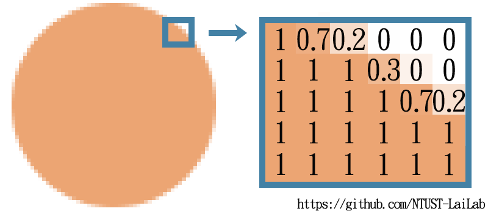
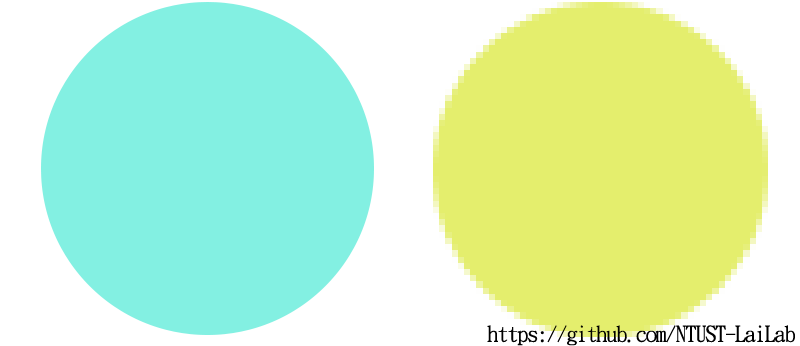
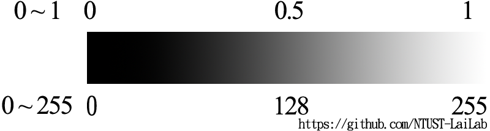
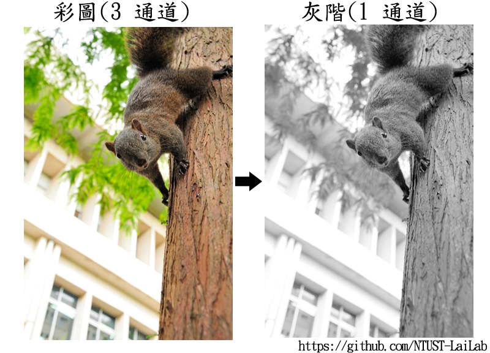
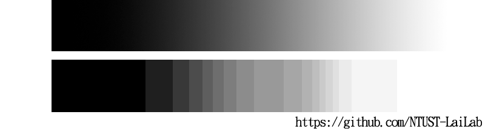
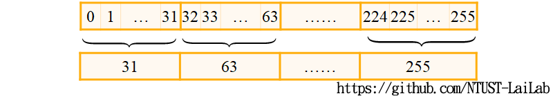
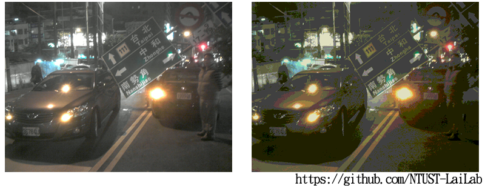
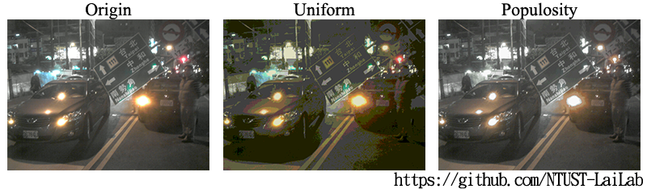
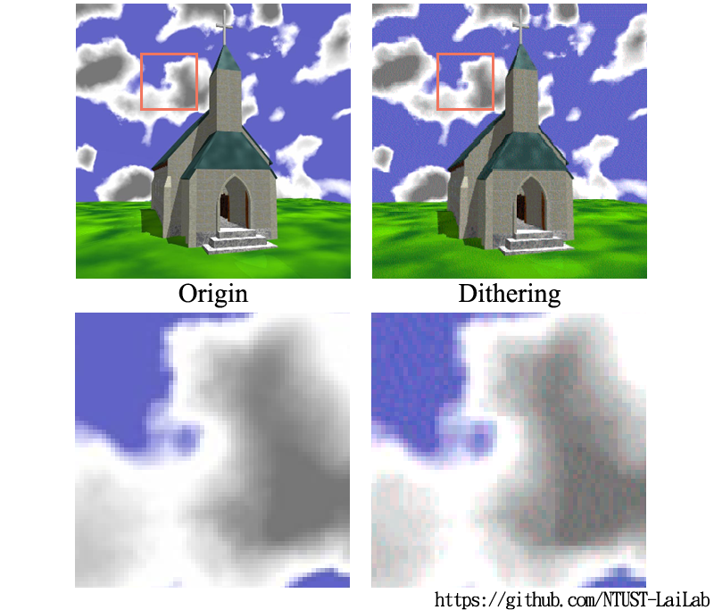

# 影像處理 - Part 1

這章節會提到關於以下幾個影像處理的部分

* [點陣圖(Raster graphics)](#點陣圖raster-graphics)
* [灰階(Grayscale)](#灰階grayscale)
* [量化(Quantized)](#量化quantized)
* [抖動(Dithering)](#抖動dithering)

> 這邊會來介紹這四種影像處理的方式
> * 點陣圖，用二維的陣列儲存，跟點陣圖相對的就是向量圖。
> * 灰階，單使用灰度值來描述一張圖片。另外，還會提到灰階化，也就是將彩色圖像轉換為黑白或灰度圖像。
> * 量化，就是將一個範圍內的色彩變成同一個數值，使圖片的色彩變得簡單，常用於壓縮圖片。
> * 抖動，像素不單純只描述當個顏色位置的數值，而是整個範圍描述其範圍顏色數值，使少量的顏色可以描述更多顏色的錯覺。

## 點陣圖(Raster graphics)

* 又稱**柵格圖**、**像素圖**等。
* 又又稱 **Raster**、**Pixel**、**Fragment** 跟 **Bitmap**
  > 他的名字很多，以上都是指點陣圖，建議可以記下來
* 柵格化形式通常為**二維像素陣列**表示
  > 點陣圖是平面的，通常由大量的方格子組成，每個方格子有一個值代表那格的顏色  
  >   
  > 圖片中，將點陣圖局部放大，可以看到是由一格一格的方形組成，在儲存上，其形式類似於使用**二維陣列**，陣列中的值則代表當格的顏色，也就是像素。因此，也稱為**二維像素陣列**  
  > 常見的數值為 0-255 的整數，這是 8 bits 的空間可以表示的範圍，而另外在影像處理上，也常使用 0-1 的浮點數來表示數值
* 向量圖與點陣圖片比較  
*   
  > 可以看到，向量圖是不會有鋸齒的，即使放再大都不會有  
  > 點陣圖由大量的格子組成，夠密集就看不到鋸齒，但是放大以後就看得到鋸齒了
* 常規的點陣圖特性
   * 簡單
     > 由二維像素陣列儲存，可以簡單的透過位置查詢其顏色，需要考慮鄰居時，可以利用迴圈的形式，將鄰居拜訪過一遍  
     > 相比之下，向量圖是用計算而成的，如果要對其做操作，就會變得非常複雜  
     > 例如，想將`向量圖vs點陣圖`的圖中間挖空，點陣圖只要改變中間對應格子的數值即可，向量圖則是要知道中間挖空的函式，並對兩個形狀計算差集  
* 通道(Channel)
  > 一個數值只能表示到灰階圖片，如下圖所示  
  >   
  > 0-255 的表示方式，0 代表黑色，255 代表白色，中間區間則代表灰色，越小越暗，反之  
  > 0-1 的表示方式，0 代表黑色，1 代表白色，中間區間則代表灰色，越小越暗，反之
  > 
  > 可以透過多個數值來表示圖片，使圖片的色彩更多元  
  > 有幾個頻道數就代表有幾個數值來表示一格的顏色  
  > 點陣圖常見的頻道多為 1、3、4，分別代表 G (灰階)、RGB (彩色)、RGBA (彩色+透明)  
  > 通常每頻道有 0-255 共 256 種數值，因此，常見的RGB (彩色) 3 頻道圖片顏色有 256 * 256 * 256 共 16,777,216 種 
* 常見的格式
   * jpg, png, tga, hdr 等等
     > jpg 會壓縮破壞圖像，因此輸出後重新讀入的數值，會與原始的不同

## 灰階(Grayscale)

  

* 又稱`灰階(Grayscale)`、`調子(Shade)`、 `亮度(Luminance)`
  > 在不同領域有不同稱呼，在影像叫做`灰階(Grayscale)`，在美術會稱`調子(Shade)`，那在物理上會叫做`亮度(Luminance)`
  > 總之，就是只用一個值來表示一個像素(Pixel)
* 灰階的應用
  * 過濾
  * 技術限制
  * 空間壓縮
  * 影像效果
  > 目前最為常見的圖片都是彩色的，也就是三通道的圖片，而將三通道的彩色圖片轉為一通道的灰階圖片，其實會減少原本的資訊  
  > 不過，灰階圖其實已經足夠表示許多細節，以前的黑白照片跟黑白電影就足夠傳達許多內容  
  > 而實際上轉為灰階還有一些實務上的應用，例如：
  > * 過濾：轉為灰階相當於計算出其亮度，再針對亮度值決定要過濾的像素
  > * 技術限制：例如一台只能顯示灰階的螢幕，就可以將彩圖經過灰階轉換，以顯示在螢幕上  
  > * 空間壓縮：三通道彩圖就比一通道灰階圖需要三倍的儲存空間，所以轉為灰階圖相當於一種圖片壓縮的方式
  > * 影像效果：灰階給人一種比較復古等的影像效果
* 將彩色(RGB)的三通道值轉為灰階(G)的一通道計算方式
  * $\text{Grayscale}=0.30\text{R}+0.59\text{G}+0.11\text{B}$
  > 最直觀的將圖片轉為灰階的計算方式：將三通道值相加除 3，這不是錯的，但是不夠符合人眼對顏色的敏感度  
  > 實際上，人眼對 RGB 三色的敏感度是`綠色`>`紅色`>`藍色`，根據統計下，形成了上述綠色約佔 0.6，紅色約佔 0.3，藍色約佔 0.1 的比例，另外，三者合計為 1

## 量化(Quantized)

* 量化(Quantized)其實就是一種壓縮技術，會讓一系列的值被壓縮成一個單獨的數值，這是一種有損壓縮，意味著在這個過程中可能會失去一些信息。當我們減少在一個數據流中的不同的符號的數量，這個數據流就更容易被壓縮。接下來我們會介紹到以下兩種 Quantized 的方式：

  > 將連續的像素值轉換為離散的像素值。這個過程可以簡單地理解為將一個連續的數值範圍分成幾個區間，然後將每個區間內的數值映射到一個離散的數值。這樣做的好處是可以減少存儲和傳輸所需的位元數量，從而節省空間和時間。  
  >     
  > 主要目的是減少數據量，從而節省存儲空間和傳輸量。

* 均勻量化(Uniform Quantized)
* 普及度演算法(Populosity Algorithm)

> 接下來將提到 Uniform 與 Populosity 兩種量化的方法。

### Uniform Quantization​

> 均勻量化(Uniform Quantization)將所有可能的像素亮度（例如，從 0 到 255）分為相等的範圍或階級。比如說，我們可以將像素亮度分為 8 個階級，那麼每個階級就包含了 32 個像素亮度 $(256/8)$  

   

> 均勻量化的好處是它很簡單，容易理解和實現。因為每個階級的範圍是一樣的，所以我們可以很容易地知道每個像素應該被分到哪一個階級。
> 但是，這也是它的一個壞處。因為在實際的圖片中，一張圖片可能顏色集中在某一個範圍上，而其他顏色可能只有很少的像素，甚至是沒有用到，像素的顏色分佈可能並不均勻，而均勻量化就會在不論是多資料還是少資料的地方，花同樣的空間作儲存。  
> 
> 例如下圖的車子圖片，顏色幾乎都集中在灰色上，而紅色與綠色的就只有局部出現而已，然而，均勻的量化，能表達灰色的顏色變得很少，所以壓縮過後，在視覺上破壞很大。
>   
> 另外補充到，均勻(Uniform)的概念在影像處理中，不僅在量化中被使用，它在很多地方都有出現，在很多領域最基礎的方法都可以用均勻做實現。比如說，在隨機數生成中，我們也可能會使用均勻分布的數字。但是，通常也是比較暴力的解法。

  

### Populosity Algorithm

> 跟暴力的均勻相比，就會有比較智慧的做法，例如，將出現次數最多的幾種顏色來做為關鍵顏色，其餘的顏色用最相近的關鍵顏色做取代。這就是這個子章節要提的普及度演算法(Populosity Algorithm)。

* **第一步**-Uniform Quantization​
> 先將相近的顏色初步的分類，以避免後續顏色找的太相近  
> 在我們專案中，先初步將 RGB 分別分成 32 類，從總共 $256^3$ 種顏色分類成 $32^3$ 種  
* **第二步**-找 N 種出現次數最多的顏色  
> N 為你選擇壓縮後能保留下來的顏色數量  
>   
> 可以看到在這個案例中，普及度演算法(Populosity Algorithm)的方法，有效的使灰色部分的失真減少  
> 程式實現上，就是遍歷所有的像素，統計出出現次數最多的 N 個顏色，以作為關鍵顏色  
> 在我們專案中，N 為 256
* **第三步**-使用歐氏距離（或稱 L2 距離）找出在 RGB 色彩空間中最接近的顏色  
  * $(r1-r2)^2+(g1-g2)^2+(b1-b2)^2$
  > 程式實現上，再一次遍歷所有的像素，將原先的顏色取代成以歐式距離計算最接近的關鍵顏色
> 但是，這樣的普及度演算法(Populosity Algorithm)有個缺點是，原先的顏色在關鍵顏色中沒有足夠相似的顏色，會失去原先的顏色，例如：例圖中 Populosity 的左上區，原先的藍色就不見了

## 抖動(Dithering)

* 抖動(Dithering)指的是在只有特定顏色可用時，試圖從特定顏色的混合中來近似需求的顏色

> 抖動(Dithering)是一種圖像處理技術，它讓我們能夠使用較少的顏色來模擬更豐富的顏色。這種技術的基礎在於人眼的視覺錯覺。實際上，當兩種不同的顏色相鄰時，我們的眼睛會將這兩種顏色混合在一起，使得人眼看起來像是看到了一種不在原始顏色選擇中的顏色，達到更豐富的視覺效果。

* 

> 上圖可以看到，這兩張整體看起來差不多，但是，Dithering 的圖片是由各種其他顏色混和，視覺上錯覺像是原本的顏色。

* 簡單閾值抖動 (Naive Threshold Dithering)
* 保持亮度的閾值抖動 (Brightness Preserving Threshold Dithering)
* 隨機抖動 (Random Dithering)
* 群聚抖動 (Clustered Dithering)
* 弗洛伊德-斯坦伯格抖動 (Floyd-Steinberg Dithering)
* 彩色弗洛伊德-斯坦伯格抖動 (Color Floyd-Steinberg Dithering)

> 
>
> 各種抖動方法的結果，可以看到：
> * 第一張為原始圖片。
> * 第二到六張，可以看到皆是用黑與白色組合而成，但是呈現的效果皆是不同的。
>   * 第二跟三張幾乎只能呈現黑白的區塊。
>   * 第四到六張則可以表現出每個區塊的深淺變化。
> * 第七張則是將弗洛伊德-斯坦伯格抖動 (Floyd-Steinberg Dithering)分別套用到彩色三個頻道上的結果。
